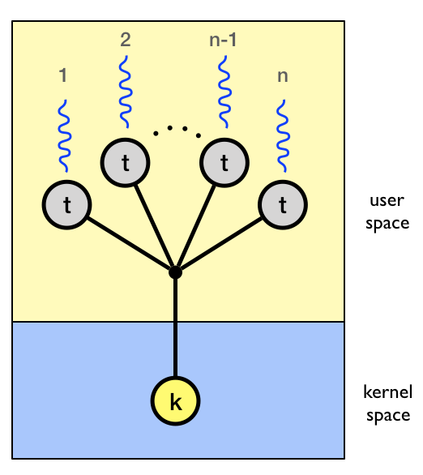

## Thread Control Functions

### Thread Library Initialisation

+ `mthread_init()` initializes the mthread library. It has to be the first mthread API function call in an application, and is mandatory. It's usually done at the begin of the `main()` function of the application. This implicitly initialises the data structures and transforms the single execution unit of the current process into a thread (the 'main' thread). It returns 0 on success.

### Thread Creation

+ In the many-to-one model all user level threads execute on the same kernel thread. The process can only run one user-level thread at a time because there is only one kernel-level thread associated with the process. The kernel has no knowledge of user-level threads.

+ To store information about a single thread, a thread control block (TCB) holding information about the state of the thread (its set of registers), information about its stack (a pointer to the thread's stack area and size), and the status of the thread (whether it is running, ready to run, or has exited) . Since there will be multiple threads active at the same time, the thread control blocks are stored in a FIFO queue. On creation of the every thread using `mthread_create()`, a TCB is allocated and initialized accordingly.

+ The new user level thread terminates in one of the following ways:
	+ It calls `mthread_exit()`, specifying an exit status value that is available to another thread in the same process that calls `mthread_join()`.
	+ It returns from `start_routine()`. This is equivalent to calling `mthread_exit()` with the value supplied in the return statement.
	+ Any of the threads in the process calls `exit(3)`, or the main thread performs a return from `main()`. This causes the termination of all threads in the process.

+ Therefore, we write a wrapper function - `mthread_start()` which grabs the argument from the TCB and then invoke the actual start function, passing it the required argument. In addition, we simply invoke `mthread_exit()` after the thread returns from the previous call to the start function with the result. For this indirection, we need to make the program counter (EIP) point to this function instead of the actual start function. For this, we manually change the **JB_PC** of the jmpbuf array.

+ We allocate the memory that is to be used for the thread's stack using `mmap(2)` rather than `malloc(3)` because `mmap(2)` allocates a block of memory that starts on a page boundary and is a multiple of the page size.  This is useful sicne we want to establish a guard page (a page with protection PROT_NONE) at the end of the stack using `mprotect(2)`.

+ The stack pointer passed to the stack pointer of the jmpbuf structure must reference the top of the stack, since on most processors the stack grows down. This is done by adding the size of the region to the base of the mmap'ed region. To avoid a memory leak, the stack must be freed once the thread has exited.

+ Linux systems are usually equipped with a libc that includes a security feature to protect the addresses stored in jump buffers. This security feature "mangles" (i.e. encrypts) a pointer before saving it in a jmp_buf. Thus, we also have to mangle our new stack pointer and program counter before we can write it into a jump buffer, otherwise decryption (and subsequent uses) will fail. To mangle a pointer before writing it into the jump buffer, we make use of the `mangle` function.

+ To change attributes of a thread like the stack size, stack base, name for user level debugging and it's detach state, an attribute object of threads passed as the second argument to `mthread_create()`. The user allocates it, and then calls `mthread_attr_init` to intialize it and `mthread_attr_destroy` to clean it up. For more info, refer thread attribute handling.

+ On succesful thread creation, the thread library provides a **thread handle** as a return value which can be further used in different thread control functions.

### Scheduling

+ A hybrid model between cooperative and preemptive scheduling is implemented where a running thread may `mthread_yield()` or be preempted by a timer.

+ Once multiple threads are running, to switch between different threads we use the library functions `sigsetjmp(3)` and `siglongjmp(3)`. In a nutshell, setjmp saves the current state of a thread into a `jmp_buf` structure. longjmp uses this structure to restore (jump back) to a previously saved state. More precisely, we have the currently executing thread call `setjmp(3)` and save the result in the thread's TCB. Then, our scheduler can pick another thread, and use the saved `jmp_buf` of that thread together with `longjmp(3)` to resume the execution of the new thread.

+ The process of picking another thread is called scheduling. In our system, we have a very simply scheduler. Just cycle through the available threads in a round robin fashion, giving an equal, fair share to each thread. 

+ To periodically switch to the next user level thread, we make use of signals. More precisely, we use the setitimer function to set up a periodic timer that sends a SIGALRM signal every X milliseconds (here, X is 10ms). When the timer expires the kernel will send a signal to the process. The scheduler is registered as a signal handler for the timer signal. 

### Thread Attribute Handling

Attribute objects are used in mthread to store attributes for to be spawned threads. They are stand-alone/unbound attribute objects i.e. they cannot modify attributes of existing threads. The following attribute fields exists in attribute objects:

+ MTHREAD_ATTR_NAME (read-write) [char *]  
Name of thread (up to 64 characters are stored only), mainly for debugging purposes.

+ MTHREAD_ATTR_JOINABLE (read-write) \[int\]  
The thread detachment type, JOINABLE indicates a joinable thread, DETACHED indicates a detached thread.

+ MTHREAD_ATTR_STACK_SIZE (read-write) [unsigned int]   
The thread stack size in bytes. Use lower values  with great care!

+ MTHREAD_ATTR_STACK_ADDR (read-write) [char *]     
A pointer to the lower address of a chunk of malloc(3)'ed memory for the stack.

`mthread_attr_t mthread_attr_new(void);`  
This returns a new unbound attribute object. An implicit mthread_attr_init() is done on it. Any queries on this object just fetch stored attributes from it. And attribute modifications just change the stored attributes. Use such attribute objects to pre-configure attributes for to be spawned threads.

`int mthread_attr_init(mthread_attr_t attr);`   
This initializes an attribute object attr to the default values:   
MTHREAD_ATTR_NAME := 'Unknown',  MTHREAD_ATTR_JOINABLE := JOINABLE, MTHREAD_ATTR_STACK_SIZE := DEFAULT and MTHREAD_ATTR_STACK_ADDR := NULL.

`int mthread_attr_set(mthread_attr_t attr, int field, ...);`   
This sets the attribute field field in attr to a value specified as an additional argument on the variable argument list. The following attribute fields and argument pairs can be used:

| Attribute       			| Type       	|
|-------------------------	|--------------	|
| MTHREAD_ATTR_NAME       	| char *       	|
| MTHREAD_ATTR_JOINABLE   	| int          	|
| MTHREAD_ATTR_STACK_SIZE 	| unsigned int 	|
| MTHREAD_ATTR_STACK_ADDR 	| void *       	|

`int mthread_attr_get(mthread_attr_t attr, int field, ...);`  
This retrieves the attribute field field in attr and stores its value in the variable specified through a pointer in an additional argument on the variable argument list. The following fields and argument pairs can be used:

| Attribute       			| Type       	|
|-------------------------	|--------------	|
| MTHREAD_ATTR_NAME       	| char **      	|
| MTHREAD_ATTR_JOINABLE   	| int *        	|
| MTHREAD_ATTR_STACK_SIZE 	| unsigned int *|
| MTHREAD_ATTR_STACK_ADDR 	| void **       |

`int mthread_attr_destroy(mthread_attr_t attr);`
This destroys a attribute object attr. After this attr is no longer a valid attribute object.

### Thread Joining

+ The `mthread_join()` function  waits for the thread specified by thread to terminate.  If that thread has already terminated, then `mthread_join()` returns immediately.  The thread specified by thread must be joinable.

+ A thread may have to wait for the completion of another thread. If the caller thread waits for an incomplete target thread to join, then it will halt till the target thread exits. This is done by changing the state of the thread to WAITING. Once the target thread has finished, the current thread will be signaled and it's state will be changed to READY again.

+ Even if a thread has finished execution, none of its allocated resources are freed. The resources of the thread are released only after the program exits to improve time complexity.

+ A thread must be joined on only once. Any further joins on an already joined thread will return errors.

+ All of the threads in a process are peers: any thread can join with any other thread in the process.

### Thread Signals

+ Signals may be sent to a specific thread using `mthread_kill()`.

+ All signals which aren't meant for the current thread are made pending for that thread. They are raised when the thread is scheduled.

+ Note : Signal  dispositions and actions are process-wide: if an unhandled signal is delivered to a thread, then it will affect (terminate, stop, continue, be ignored in) all members of the thread group.

### Thread Exiting

+ As mentioned previously, a thread can exit using the `mthread_exit()` function. The thread can also return a value while it is exiting, to be returned to the thread joining on it. This is done by storing it's result in the TCB and marking the state of the thread as FINISHED.

+ Any threads joined on the thread exiting are signaled the about the completion of this thread.

### Thread Yielding

+ Yield execution control to next thread by simply calling `mthread_yield()`. It is simply a wrapper for a `raise(SIGVTALRM)`

### Thread Detachment

+ The `mthread_detach()` function marks the thread passed as argument as detached. Any other thread trying to join on a detached thread will result in an error.

### Thread Equality

+ The `mthread_equal()` function checks whether the threads identified by their thread handles are the same or not. Returns 0 if equal and non-zero if not.

### Synchronisation Primitives

#### Spinlocks
A spinlock is a lock which causes a thread trying to acquire it to simply wait in a loop ("spin") while repeatedly checking if the lock is available. The advantage of a spinlock is that the thread is kept active and does not enter a sleep-wait for a mutex to become available, thus can perform better in certain cases than typical blocking-sleep-wait style mutexes.

Functions used in conjunction with the spinlock:

Creating/Destroying:   
`mthread_spinlock_t spinlock = MTHREAD_SPINLOCK_INITIALIZER;`   
`mthread_spinlock_init()`   
`mthread_spinlock_destroy()`

Attempt to lock the spinlock (returns immediately with EBUSY if locked):   
`mthread_spinlock_trylock()`

Lock the spinlock (blocks until spinlock is unlocked):   
`mthread_spinlock_lock()`

Unlock the spinlock:   
`mthread_spinlock_unlock()`