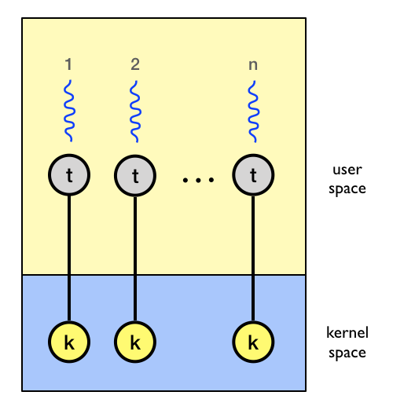

## Thread Control Functions

### Thread Library Initialisation

+ `mthread_init()` initializes the mthread library. It has to be the first mthread API function call in an application, and is mandatory. It's usually done at the begin of the `main()` function of the application. This implicitly initialises the data structures and transforms the single execution unit of the current process into a thread (the 'main' thread). It returns 0 on success.

### Thread Creation

+ On Linux, threads and processes are treated the same. They are both considered to be tasks. One process may consists of many threads.

+ Every thread has it's own TID (Thread ID), saved registers, stack pointer, instruction pointer, stack(local variables, return addresses, etc.), signal mask, and priority (scheduling information) and shares everything else with the parent process depending on flags used while cloning.
	+ Scheduling is managed by the kernel scheduler itself. So no priority is maintained.
	+ We need to maintain a separate stack and it's size per thread.

+ On Linux, kernel threads are created with the `clone` system call. It is similar to fork (creates a task which is executing the current program), however it differs in that clone specifies which resources should be shared. To create a thread, we call clone to create a task which shares as much as possible: The memory space, file descriptors and signal handlers, etc.

+ We allocate the memory that is to be used for the thread's stack using `mmap(2)` rather than `malloc(3)` because `mmap(2)` allocates a block of memory that starts on a page boundary and is a multiple of the page size.  This is useful sicne we want to establish a guard page (a page with protection PROT_NONE) at the end of the stack using `mprotect(2)`.

+ The stack pointer passed to clone must reference the top of the stack, since on most processors the stack grows down. This is done by adding the size of the region to the base of the mmap'ed region. To avoid a memory leak, the stack must be freed once the thread has exited.

+ For book-keeping, thread specific data is maintained in a Thread Control Block (TCB). On creation of the every thread using `mthread_create()`, a TCB is allocated and initialized accordingly.

+ The new thread terminates in one of the following ways:
	+ It calls `mthread_exit()`, specifying an exit status value that is available to another thread in the same process that calls `mthread_join()`.
	+ It returns from `start_routine()`. This is equivalent to calling mthread_exit() with the value supplied in the return statement.
	+ Any of the threads in the process calls `exit(3)`, or the main thread performs a return from main(). This causes the termination of all threads in the process.

+ To replicate above behaviour, the user `start_function(args)` are wrapped in an internal `mthread_start()` function.

+ To change attributes of a thread like the stack size, stack base, name for user level debugging and it's detach state, an attribute object of threads passed as the second argument to 	`mthread_create()`. The user allocates it, and then calls `mthread_attr_init` to intialize it and `mthread_attr_destroy` to clean it up. For more info, refer thread attribute handling.

+ On succesful thread creation, the thread library provides a **thread handle** as a return value which can be further used in different thread control functions.

### Thread Attribute Handling

Attribute objects are used in mthread to store attributes for to be spawned threads. They are stand-alone/unbound attribute objects i.e. they cannot modify attributes of existing threads. The following attribute fields exists in attribute objects:

+ MTHREAD_ATTR_NAME (read-write) [char *]  
Name of thread (up to 64 characters are stored only), mainly for debugging purposes.

+ MTHREAD_ATTR_JOINABLE (read-write) \[int\]  
The thread detachment type, JOINABLE indicates a joinable thread, DETACHED indicates a detached thread.

+ MTHREAD_ATTR_STACK_SIZE (read-write) [unsigned int]   
The thread stack size in bytes. Use lower values  with great care!

+ MTHREAD_ATTR_STACK_ADDR (read-write) [char *]     
A pointer to the lower address of a chunk of malloc(3)'ed memory for the stack.

`mthread_attr_t mthread_attr_new(void);`  
This returns a new unbound attribute object. An implicit mthread_attr_init() is done on it. Any queries on this object just fetch stored attributes from it. And attribute modifications just change the stored attributes. Use such attribute objects to pre-configure attributes for to be spawned threads.

`int mthread_attr_init(mthread_attr_t attr);`   
This initializes an attribute object attr to the default values:   
MTHREAD_ATTR_NAME := 'Unknown',  MTHREAD_ATTR_JOINABLE := JOINABLE, MTHREAD_ATTR_STACK_SIZE := DEFAULT and MTHREAD_ATTR_STACK_ADDR := NULL.

`int mthread_attr_set(mthread_attr_t attr, int field, ...);`   
This sets the attribute field field in attr to a value specified as an additional argument on the variable argument list. The following attribute fields and argument pairs can be used:

| Attribute       			| Type       	|
|-------------------------	|--------------	|
| MTHREAD_ATTR_NAME       	| char *       	|
| MTHREAD_ATTR_JOINABLE   	| int          	|
| MTHREAD_ATTR_STACK_SIZE 	| unsigned int 	|
| MTHREAD_ATTR_STACK_ADDR 	| void *       	|

`int mthread_attr_get(mthread_attr_t attr, int field, ...);`  
This retrieves the attribute field field in attr and stores its value in the variable specified through a pointer in an additional argument on the variable argument list. The following fields and argument pairs can be used:

| Attribute       			| Type       	|
|-------------------------	|--------------	|
| MTHREAD_ATTR_NAME       	| char **      	|
| MTHREAD_ATTR_JOINABLE   	| int *        	|
| MTHREAD_ATTR_STACK_SIZE 	| unsigned int *|
| MTHREAD_ATTR_STACK_ADDR 	| void **       |

`int mthread_attr_destroy(mthread_attr_t attr);`
This destroys a attribute object attr. After this attr is no longer a valid attribute object.

### Thread Joining

+ The `mthread_join()`  function  waits  for  the thread specified by thread to terminate.  If that thread has already terminated, then `mthread_join()` returns immediately.  The thread specified by thread must be joinable.

+ A thread may have to wait for the completion of another thread. If the caller thread waits for an incomplete target thread to join, then it will halt till the target thread exits. This wait is implemented using `futex(2)`.

+ When the thread was created, a variable of the TCB was set to it's TID. By passing CLONE_CHILD_CLEARTID to `clone(2)`, it is made sure that this variable has the TID as long as the thread is running. It also clears (zero) the TID at the location pointed by the variable when the child exits, and does a wakeup on the  futex  at that address.

+ Even if a thread has finished execution, none of its allocated resources are freed. The resources of the thread are released only after the program exits to improve time complexity.

+ A thread must be joined on only once. Any further joins on an already joined thread will return errors.

+ All of the threads in a process are peers: any thread can join with any other thread in the process.

### Thread Signals

+ Signals may be sent to a specific thread or a thread group using `mthread_kill()`.

+ For this `tgkill(2)` was used to direct the signals to the target thread.

+ Note : Signal  dispositions and actions are process-wide: if an unhandled signal is delivered to a thread, then it will affect (terminate, stop, continue, be ignored in) all members of the thread group.

### Thread Exiting

+ As mentioned previously, a thread can exit using the `mthread_exit()` function. The thread can also return a value while it is exiting, to be returned to the thread joining on it. This is done by storing it's result in the TCB.

+ When the thread was created, `clone(2)` was passed the `mthread_start()` as start function of the thread. To exit safely, it is important that `mthread_exit()` returns to `mthread_start()` since that is how clone will return. For this `sigsetjmp(3)` and `siglongjmp(3)` are used.

### Thread Yielding

+  Yield execution control to next thread by simply calling `mthread_yield()`. It is simply a wrapper for a `sched_yield(2)`

### Thread Detachment

+ The `mthread_detach()` function marks the thread passed as argument as detached. Any other thread trying to join on a detached thread will result in an error.

### Thread Equality

+ The `mthread_equal()` function checks whether the threads identified by their thread handles are the same or not. Returns 0 if equal and non-zero if not.

### Synchronisation Primitives

#### Spinlocks
A spinlock is a lock which causes a thread trying to acquire it to simply wait in a loop ("spin") while repeatedly checking if the lock is available. The advantage of a spinlock is that the thread is kept active and does not enter a sleep-wait for a mutex to become available, thus can perform better in certain cases than typical blocking-sleep-wait style mutexes.

Functions used in conjunction with the spinlock:

Creating/Destroying:   
`mthread_spinlock_init()`   
`mthread_spinlock_destroy()`

Attempt to lock the spinlock (returns immediately with EBUSY if locked):   
`mthread_spinlock_trylock()`

Lock the spinlock (blocks until spinlock is unlocked):   
`mthread_spinlock_lock()`

Unlock the spinlock:   
`mthread_spinlock_unlock()`

#### Mutexes
Mutexes are used to prevent data inconsistencies due to race conditions (when two or more threads need to perform operations on the same memory area, but the results of computations depends on the order in which these operations are performed). Mutexes are used for serializing shared resources. Anytime a global resource is accessed by more than one thread the resource should have a mutex associated with it. One can apply a mutex to protect a segment of memory ("critical region") from other threads.

Functions used in conjunction with the mutex:

Creating/Destroying:   
`mthread_mutex_t mutex = MTHREAD_MUTEX_INITIALIZER;`   
`mthread_mutex_init()`   
`mthread_mutex_destroy()`

Attempt to lock the mutex (returns immediately with EBUSY if locked):   
`mthread_mutex_trylock()`

Lock the mutex (blocks until mutex is unlocked):   
`mthread_mutex_lock()`

Unlock the mutex:   
`mthread_mutex_unlock()`

#### Condition Variable
While mutexes implement synchronization by controlling thread access to data, condition variables allow threads to synchronize based upon the actual value of data. The condition variable mechanism allows threads to suspend execution and relinquish the processor until some condition is true. A condition variable must always be associated with a mutex to avoid a race condition created by one thread preparing to wait and another thread which may signal the condition before the first thread actually waits on it resulting in a deadlock. The thread will be perpetually waiting for a signal that is never sent. Any mutex can be used, there is no explicit link between the mutex and the condition variable.

Functions used in conjunction with the condition variable:

Creating/Destroying:   
`mthread_cond_t cond = MTHREAD_COND_INITIALIZER;`   
`mthread_cond_init()`   
`mthread_cond_destroy()`

Waiting on condition:   
`mthread_cond_wait()`

Waking thread based on condition:   
`mthread_cond_signal()`

#### Semaphores
A Semaphore is a thread synchronization construct that can be used either to send signals between threads to avoid missed signals, or to guard a critical section like you would with a lock. Semaphores are also specifically designed to support an efficient waiting mechanism. If a thread can’t proceed until some change occurs, it is undesirable for that thread to be looping and repeatedly checking the state until it changes. In this case semaphore can be used to represent the right of a thread to proceed. A non-zero value means the thread
should continue, zero means to hold off. When a thread attempts to decrement a unavailable semaphore (with a zero value), it efficiently waits until another thread increments the semaphore to signal the state change that will allow it to proceed.

Functions used in conjunction with the semaphore:

Creating/Destroying:   
`mthread_sem_t sem = MTHREAD_SEM_INITIALIZER;`   
`mthread_sem_init()`   
`mthread_sem_destroy()`

Waiting on condition:   
`mthread_sem_wait()`

Waking thread based on condition:   
`mthread_sem_post()`